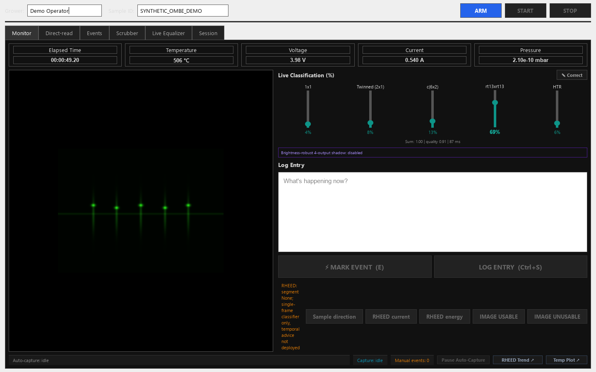
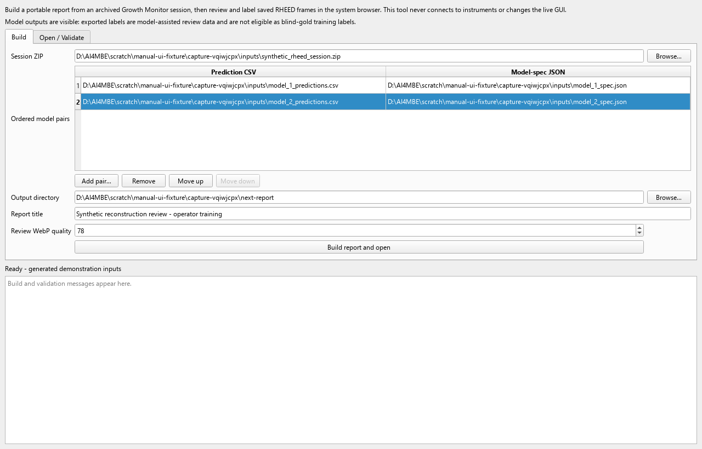
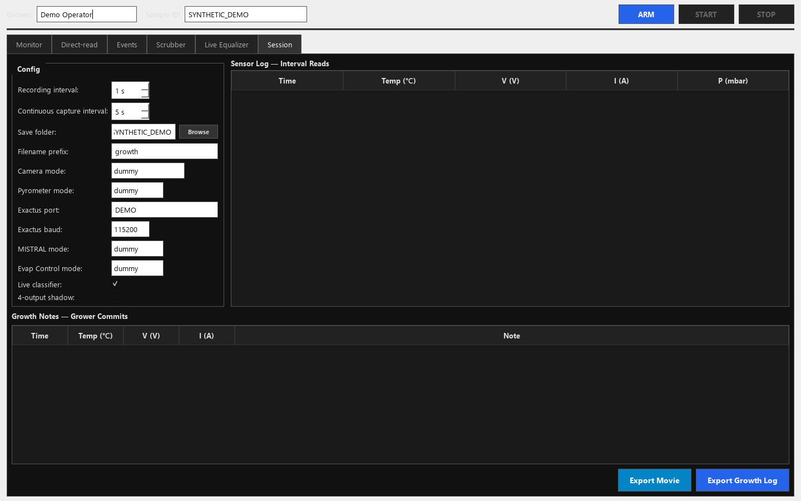
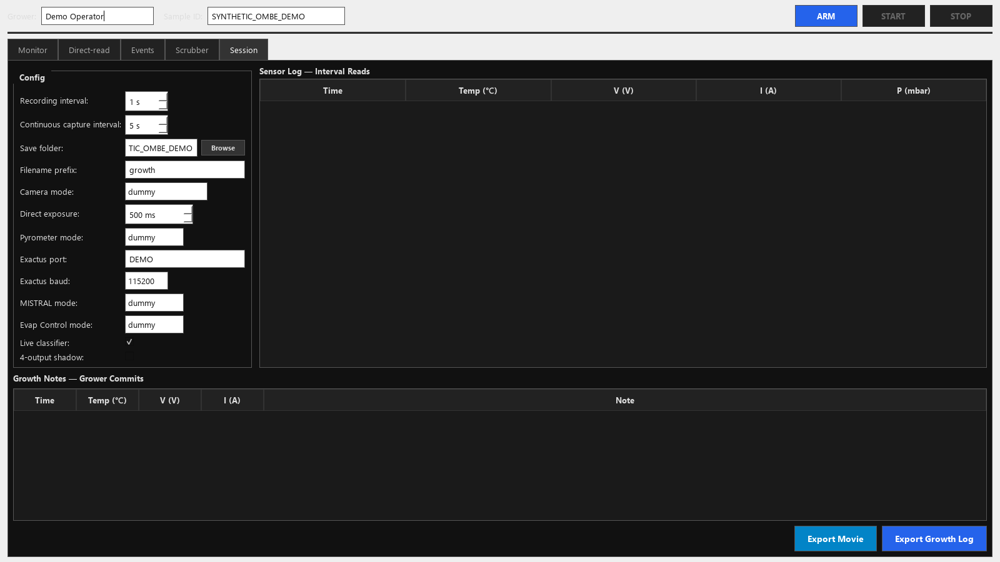
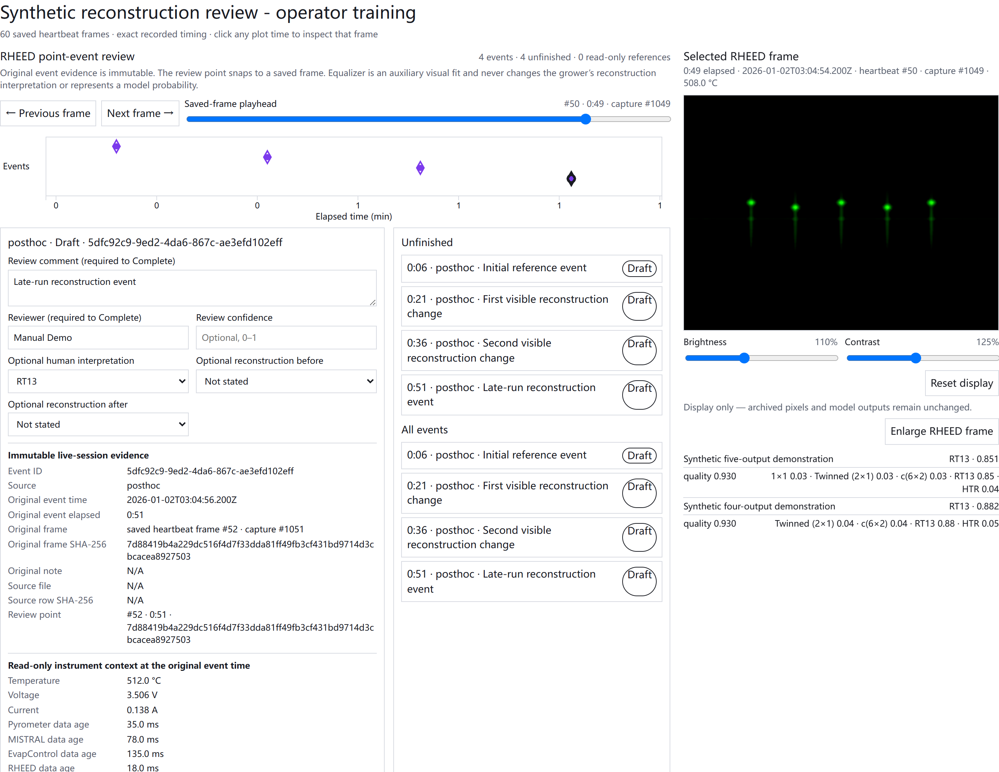
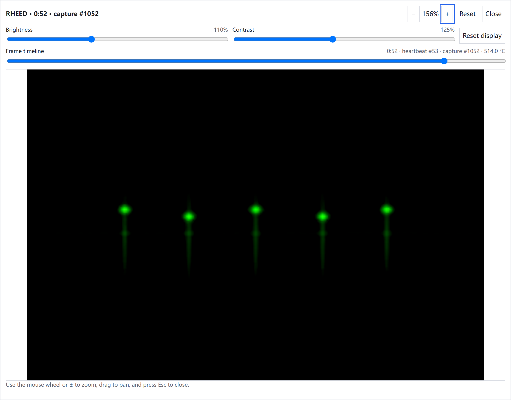

# O-MBE and Ch-MBE GUI and RHEED Post-processing Labeling

## English Operator Manual

- Manual version: **v1.7**
- Issued: **2026-08-12**
- Scope: Windows O-MBE and Ch-MBE workstations and the shared offline RHEED post-processing labeler

This Markdown document is the accessible companion to the [English PDF manual](RHEED_GUI_Postprocessing_Labeling_User_Manual_EN.pdf). The screenshots show the actual applications with generated demo inputs. They do not contain experimental data and do **not** define production defaults for Ch-MBE or O-MBE.

| Ch-MBE Growth Monitor demo | O-MBE Growth Monitor demo |
| --- | --- |
|  |  |

> **Screenshot scope:** These are the actual chamber-specific applications with generated demo inputs. They illustrate the implemented interfaces only and are not evidence of either chamber's approved configuration.

> **Core boundary:** The post-processing labeler reads archived data only. It does not connect to or control cameras, pyrometers, power supplies, or any other instrument.

### Quick entry

| Purpose | Double-click |
| --- | --- |
| Ch-MBE live GUI | `Start Ch-MBE Growth Monitor.cmd` |
| O-MBE live GUI | `Start O-MBE Growth Monitor.cmd` |
| RHEED offline labeler | `Start RHEED Post-processing Labeler.cmd` |
| Install or refresh desktop shortcuts | `Install AI4MBE Desktop Shortcuts.cmd` |

### Contents

1. [Understand the two independent paths](#1-understand-the-two-independent-paths)
2. [Install shortcuts and start the correct chamber GUI](#2-install-shortcuts-and-start-the-correct-chamber-gui)
3. [Understand Configuration modes and chamber defaults](#3-understand-configuration-modes-and-chamber-defaults)
4. [Open the RHEED post-processing labeler](#4-open-the-rheed-post-processing-labeler)
5. [Prepare inputs and verify provenance](#5-prepare-inputs-and-verify-provenance)
6. [Build and open a report safely](#6-build-and-open-a-report-safely)
7. [Label temporal segments like an editing timeline](#7-label-temporal-segments-like-an-editing-timeline)
8. [Review, display controls, and drafts](#8-review-display-controls-and-drafts)
9. [Export, import, and fail-closed validation](#9-export-import-and-fail-closed-validation)
10. [Data safety and scientific boundaries](#10-data-safety-and-scientific-boundaries)
11. [Troubleshooting](#11-troubleshooting)
12. [Version verification and quick checklist](#12-version-verification-and-quick-checklist)

## 1. Understand the two independent paths

### In brief

- The live GUI acquires and displays instrument data and writes the session archive.
- The offline labeler reads a completed archive, prediction tables, and model specifications.
- The offline tool never sends commands back to instruments.
- Surface reconstruction, acquisition QC, and FeSe film quality are different concepts.

### Live acquisition and offline review

The live GUI performs acquisition and display. The offline labeler works only on completed archived sessions. Never interpret an offline result as a real-time control instruction.

| Live acquisition | Offline build and validation |
| --- | --- |
|  |  |
| Growth Monitor writes the archived session. | The labeler combines the ZIP with predictions and model specifications. |

> **Application boundary:** The live GUI creates session records. The labeler reads those records later, produces a browser report, and exports validated JSON. It never sends commands back to instruments.

### Operating principle

- The GUI reads live instrument sources and writes session records under operator control.
- Post-processing combines an archived session with one or more already-generated prediction tables.
- Human labels are stored as frame-bound temporal segments with provenance.
- Model outputs remain visible, so these annotations are assisted review, not blind-gold labels.

> **Keep the concepts separate:** Surface-reconstruction labels, acquisition-quality QC, and FeSe film quality are three different concepts. The current classifier concerns the bare STO surface before growth.

## 2. Install shortcuts and start the correct chamber GUI

### In brief

1. Install or refresh the shortcuts from the current repository checkout.
2. Choose the launcher that matches the physical chamber and verify its exact window title.
3. Check the matching chamber register in [Chapter 3](#3-keep-ch-mbe-and-o-mbe-defaults-separate), then inspect live sources and logging before ARM.
4. ARM only under the applicable experiment SOP and close normally so logs finish writing.

### Shared first setup or after moving the checkout

1. From the GUI repository root, double-click `Install AI4MBE Desktop Shortcuts.cmd`.
2. Confirm that the desktop contains refreshed shortcuts named **Ch-MBE Growth Monitor**, **O-MBE Growth Monitor**, and **RHEED Post-processing Labeler**.
3. If Windows displays an unexpected security warning, do not bypass it. Stop and ask the maintainer to verify the file source and commit.

### Current combined deployment branch

The branch that contains the current Ch-MBE/O-MBE launchers, the standalone
offline labeler, this manual, and the bundled brightness-robust four-output
model is:

`codex/gui-brightness-robust-four-output-shadow`

Record the exact commit before every acquisition or labeling run. Do not infer
the branch from the folder name, and do not substitute `main` unless the team
has separately verified that all four components are present there.

### Select the chamber before launch

| Physical chamber | Required launcher | Expected window title | Forced chamber identity |
| --- | --- | --- | --- |
| Ch-MBE | `Start Ch-MBE Growth Monitor.cmd` | **Chalcogenide MBE Growth Monitor** | `AIQM_CHAMBER=chmbe` |
| O-MBE | `Start O-MBE Growth Monitor.cmd` | **Oxide MBE Growth Monitor** | `AIQM_CHAMBER=ombe` |

> **Stop on disagreement:** If the physical chamber, launcher, title, or displayed chamber identity do not agree, close the GUI normally and investigate. Do not ARM. The launcher selects the chamber; changing a GUI field is not a substitute.

<a id="chmbe-launch-route"></a>
### Ch-MBE launch route

Double-click `Start Ch-MBE Growth Monitor.cmd` or **Ch-MBE Growth Monitor**. The launcher calls the shared startup path for the Ch-MBE application, forces `AIQM_CHAMBER=chmbe`, uses the Ch-MBE single-instance mutex, performs preflight, and records launcher diagnostics. Continue only when the title is **Chalcogenide MBE Growth Monitor**. Use only the [Ch-MBE startup-default record](#chmbe-approved-defaults).

<a id="ombe-launch-route"></a>
### O-MBE launch route

Double-click `Start O-MBE Growth Monitor.cmd` or **O-MBE Growth Monitor**. The launcher calls the shared PowerShell startup with `-Application ombe`, forces `AIQM_CHAMBER=ombe`, uses the O-MBE single-instance mutex, performs preflight, and records launcher diagnostics. Continue only when the title is **Oxide MBE Growth Monitor**. Use only the [O-MBE startup-default record](#ombe-approved-defaults).

### Shared pre-ARM and shutdown checks

1. Confirm the physical chamber, launcher route, exact title, and displayed chamber identity.
2. Inspect every device status. Confirm an advancing RHEED frame sequence, a valid temperature state, and the intended log directory under the applicable chamber SOP.
3. Verify the four reader modes against the matching startup-default record in [Chapter 3](#3-understand-configuration-modes-and-chamber-defaults), then verify all remaining operating settings against the applicable SOP.
4. ARM or start a session only when the authorized operator is ready under the applicable experiment SOP. Launching the GUI does not authorize setpoint changes.
5. At the end, close through the GUI normally and wait for the window to disappear. Do not force-kill Python while logs are being written.

| Ch-MBE Session tab demo | O-MBE Session tab demo |
| --- | --- |
|  |  |

> **Screenshot status:** These are the actual chamber-specific Session tabs in hardware-free demos. Their dummy selections are demonstration values, not Ch-MBE or O-MBE production defaults. Confirm the physical chamber and every selected interface before ARM.

Each live launcher refuses a second process for the same application through its chamber-specific Windows single-instance mutex. The two launchers do not make their configurations interchangeable.

> **Expected environment behavior:** Launcher logs are stored below `%LOCALAPPDATA%\AI4MBE\LauncherLogs`. They record the resolved Python interpreter, repository path, branch, commit, chamber, and optional-driver status. A missing optional driver produces a visible warning without hiding the GUI; do not ARM a production mode that needs the missing driver. Do not assume a fixed drive letter or create global environment variables ad hoc.

## 3. Understand Configuration modes and chamber defaults

### In brief

- `vimba`, `modbus`, and `ads` are the validated direct-read startup paths for both chambers.
- Both O-MBE and Ch-MBE default EvapControl to `elog`, so all four startup readers use direct data paths.
- Every `dummy` option supplies generated test data and is not an instrument reading.
- The save folder and both model switches must be set before ARM; they lock while armed or running.
- Selecting a mode changes only how the GUI reads data. It does not change an instrument setpoint or prove hardware synchronization.

The four selectors are independent. Their selected values are frozen when the session is armed.

### Camera mode - RHEED image source

| Option | Meaning |
| --- | --- |
| `dummy` | Fixed generated/demo STO 1x1 image; no camera connection. |
| `dummy_c6x2` | Fixed c(6x2) demonstration image; no camera connection. |
| `dummy_tw` | Fixed Twinned (2x1) demonstration image; no camera connection. |
| `dummy_rt13_tilted` | Rotated RT13 demonstration image for alignment testing; no camera connection. |
| `screengrab` | Windows Graphics Capture of a detached kSA **Live Video** window. It captures composed window pixels, not raw camera data. |
| `screengrab_mss` | Legacy monitor-pixel capture. Window position, overlap, DPI, and foreground order can contaminate frames; diagnostic fallback only. |
| `vimba` | Direct AVT camera acquisition through the Vimba SDK. This is the default live RHEED source. kSA camera ownership/access mode must permit the connection. |

### Pyrometer mode - substrate temperature source

| Option | Meaning |
| --- | --- |
| `dummy` | Generated temperature values for offline GUI checks; not an instrument reading. |
| `exactus` | Direct serial read using the Exactus protocol and the displayed COM/baud fields. |
| `modbus` | Direct read using the chamber profile's COM, baud, RTS, device ID, and Modbus backend. This is the default. |
| `screengrab` | Reads the existing TemperaSure application through Windows UI automation. It depends on the correct window being open and updating. |

### MISTRAL mode - power and cell data source

| Option | Meaning |
| --- | --- |
| `dummy` | Generated voltage/current values; no PLC or MISTRAL connection. |
| `screengrab` | Captures MistralGui and OCRs setpoint and actual voltage/current. The window must be visible and its layout must match the calibrated crop. |
| `jsonrpc` | Experimental HTTP direct connection. Its read-method map is not configured, so it can connect while returning no V/I values; do not use for production logging. |
| `ads` | Read-only direct Beckhoff TwinCAT ADS access using the chamber-specific endpoint, ports, schema, and cell count. This is the default. |

### EvapControl mode - pressure and evaporation data source

| Option | Meaning |
| --- | --- |
| `dummy` | Generated pressure values; no EvapControl connection. |
| `elog` | Directly reads EvapControl's current `.elo` binary log. It needs no OCR or visible window and can expose pressure, substrate, cell, and plasma fields present in the validated schema. |
| `screengrab` | Captures the Evaporation Control window and OCRs chamber pressure. The window must be visible; fields absent from the crop remain unavailable. |

> **Direct read is not hardware synchronization:** `vimba`, `modbus`, `ads`, and `elog` avoid screen OCR, but their workers receive data independently. A sensor-log row is a latest-value software snapshot, not proof that exposure, temperature, PLC, and EvapControl were physically sampled at one instant.

### Save folder and model switches

| Setting | Exact behavior in this branch |
| --- | --- |
| **Save folder / Browse** | Selects the root for new session output. Set and verify it before ARM. It locks while armed or running and does not move an older session. |
| **Live classifier** | Starts the existing five-output bare-STO classifier worker when checked. It is checked by default. Unchecking it before ARM prevents that worker from loading. |
| **4-output shadow** | Starts the bundled 36-head `all_extreme` ensemble when checked. It is unchecked by default. Its outputs are conditional scores for Twinned, c(6x2), RT13, and HTR; there is no 1x1 output. |
| **Events / Classify!** | Performs a separate on-demand classification in the Events page. The two live-model checkboxes do not disable this button. |

The four-output route is `weak_shadow_only` and `deployment_eligible=false`.
Its values are not surface fractions, are not a FeSe classifier, and must not
drive advice, control, or automatic capture. Pixel-difference automatic
capture and ordinary logging continue when both live models are off.

To change either model switch, STOP and DISARM first, change the checkbox, and
ARM again. For FeSe growth recording, leave both **Live classifier** and
**4-output shadow** unchecked and do not use **Events / Classify!**. These
models concern the bare STO surface before growth, not FeSe film quality or
FeSe reconstruction.

<a id="chmbe-approved-defaults"></a>
### Ch-MBE GUI startup defaults

This record applies only to the [Ch-MBE launch route](#chmbe-launch-route).

| Selector | Startup selection and source |
| --- | --- |
| Camera | `vimba` - direct AVT camera read |
| Pyrometer | `modbus` - COM3, 115200 baud, device 1, RTS off, `raw_serial` backend |
| MISTRAL | `ads` - chamber-specific read-only ADS profile, 7 cells |
| EvapControl | `elog` - direct read from the Ch-MBE `.elo` log directory |

<a id="ombe-approved-defaults"></a>
### O-MBE GUI startup defaults

This record applies only to the [O-MBE launch route](#ombe-launch-route).

| Selector | Startup selection and source |
| --- | --- |
| Camera | `vimba` - direct AVT camera read |
| Pyrometer | `modbus` - COM4, 115200 baud, device 1, RTS off, `pymodbus` backend |
| MISTRAL | `ads` - chamber-specific read-only ADS profile, 6 cells |
| EvapControl | `elog` - direct current `.elo` log read |

### What remains chamber-owner controlled

These are software startup selections, not permission to ARM. ROI/crop, classifier package and enable state, save root and naming, sampling intervals, and every instrument setpoint remain governed by the matching chamber SOP and owner approval. Each chamber passes its own log directory to `ElogReader`; variables absent from that chamber's schema remain blank rather than being invented.

## 4. Open the RHEED post-processing labeler

### In brief

1. Start the dedicated offline-labeler shortcut.
2. Confirm the **Build** and **Open / Validate** tabs and their expected buttons.
3. Verify that Growth Monitor and instrument processes do not start.

1. Double-click `Start RHEED Post-processing Labeler.cmd` or its desktop shortcut.
2. Confirm that the application has the **Build** and **Open / Validate** tabs, plus **Build report and open**, **Open report**, **Validate annotations**, and **Open English PDF manual**. It must not start Growth Monitor or contact instruments.


> **Screenshot status:** This is the actual desktop labeler Build tab populated with a generated local fixture. The application is offline and no instrument process is running.

| Area | Purpose |
| --- | --- |
| Session ZIP | Select one archived Growth Monitor session. |
| Model inputs | Pair one prediction CSV with its model-spec JSON on each row. |
| Output directory | Select a new or empty directory, preferably outside Git. |
| Message log | Preserve complete build and validation messages. |
| Open report button | Open a previously generated `interactive_report.html`. |
| Validate annotations | Check exported JSON against the exact report provenance. |

> **Offline by design:** This application can run on a computer without instrument software when the archived inputs are complete and the Python environment is valid. Report construction and validation run in an isolated child process so the desktop application remains responsive.

## 5. Prepare inputs and verify provenance

### In brief

- Use the original session ZIP without manually renaming or reordering frames.
- Pair every prediction CSV with its matching model-spec JSON in the same row order.
- Let the tool verify saved-frame provenance, timing, filenames, and SHA-256 values.
- Any mismatch stops the build; never edit inputs to bypass the check.

### Session archive

The ZIP archive must contain exactly one member ending in `session_metadata.json`, exactly one member ending in `heartbeat_log.csv`, and every sibling `frames/` image referenced by the heartbeat rows. Saved-frame elapsed time, heartbeat index, capture sequence, and timezone-aware capture UTC must each increase strictly; gaps are allowed. Do not extract and rename frames manually.

Read `chamber_id` from the session metadata and confirm that it names the intended O-MBE or Ch-MBE source. When the recorded MISTRAL mode is ADS, also preserve its recorded endpoint, ports, and cell count. Compare provenance only with the corresponding [Ch-MBE](#chmbe-approved-defaults) or [O-MBE](#ombe-approved-defaults) startup-default record; never edit an archive to make it resemble the other chamber.

```text
growth_session.zip
  session_metadata.json
  heartbeat_log.csv
  frames/
    heartbeat_000001_....bmp
    heartbeat_000002_....bmp
```

### Prediction tables and model specifications are positional pairs

| File | Required content | Check |
| --- | --- | --- |
| Prediction CSV | Frame index, heartbeat index, elapsed time, capture UTC, capture sequence, frame name, frame SHA-256, and score columns | Rows match the saved-frame order exactly. |
| Model-spec JSON | Schema version 1, non-empty key and title, at least two unique classes, and equally sized unique probability columns | Class order matches the score columns; status and provenance are optional. |
| Session ZIP | Metadata, heartbeat log, and frames | Every referenced frame exists in the archive. |

Prediction `frame_index` may begin at 0 or 1, but it must then remain contiguous. Heartbeat indices, capture sequences, and elapsed times may contain gaps. The tool follows actual saved frames and recorded times; it never assumes exact 1 Hz sampling.

> **Fail closed:** Any mismatch in row count, order, time, sequence, filename, or SHA-256 stops the build. Do not edit the inputs to bypass an error.

### Recommended local layout

Use a local data root outside the source repository. The names below are illustrative only and contain no real experimental path:

```text
<local-data-root>\<run-name>\
  source\growth_session.zip
  predictions\model_A.csv
  specs\model_A.json
  output\
  exports\
```

## 6. Build and open a report safely

### In brief

1. Select the preserved ZIP and each correctly paired prediction/specification row.
2. Choose a new or empty output directory outside Git.
3. Build, wait for success, and keep the entire generated report directory together.
4. Use CLI overwrite only when you understand its strict safety boundary.

1. Choose the preserved archive copy in **Session ZIP**.
2. Add one Prediction CSV and Model-spec JSON row for every model to display. Pairing is positional, so preserve row order.
3. Choose a new or empty directory outside the repository. The desktop labeler will not overwrite a non-empty directory.
4. Enter a report title. Review quality changes only the lossy review images; it never changes archived pixels or model predictions. The default value of 78 is suitable for routine use.
5. Click **Build report and open**. Wait for success and for `interactive_report.html` to open automatically.

### PowerShell fallback

```powershell
Set-Location '<GUI repository>'
conda activate ai4mbe-gui
python -m tools.rheed_postprocessing_labeling build `
  --session '<local-data-root>\growth_session.zip' `
  --predictions '<local-data-root>\predictions.csv' `
  --model-spec '<local-data-root>\model_spec.json' `
  --output-dir '<local-data-root>\labeling-output'
```

### Copy the entire report directory

The report consists of `interactive_report.html`, `images/`, `vendor/`, and `run_manifest.json`. Copy the entire directory during handoff. Preserve the original prediction CSV and model-spec JSON separately outside the report directory.

> **Advanced CLI overwrite boundary:** The desktop application always refuses a non-empty output directory. CLI `--overwrite` may replace only a recognized, unmodified tool output. It validates the new inputs and stages a complete replacement first. If the old report changes during the build, replacement stops and the original content is restored. Filesystem roots, repository paths, the current directory, and directories containing inputs are always rejected.

## 7. Label temporal segments like an editing timeline

### In brief

1. Move the synchronized playhead to the first saved frame and select **Mark In**.
2. Move to the inclusive final frame and select **Mark Out**.
3. Choose a label, identify the labeler, add useful notes, and save the segment.
4. Review endpoints frame by frame; adjacent segments are allowed, but overlap is rejected.



> **Screenshot status:** This is the actual English browser editor with generated RHEED frames, synthetic model curves, saved human segments, and a synchronized playhead.

1. Move the Frame playhead or click a model plot to locate the first saved frame of a segment. Click **Mark In**.
2. Move to the final saved frame of the segment and click **Mark Out**. The Out marker is inclusive.
3. Choose a reconstruction label, enter the labeler name, add notes when useful, and click **Add segment**.
4. Select a saved segment to edit it. Update preserves its annotation ID. Adjacent segments are allowed; overlapping segments are rejected.

The displayed and exported saved-frame ordinal is 1-based. Every endpoint also records heartbeat index, capture sequence, UTC, and frame SHA-256. This preserves traceability even when the sampling interval or sequence contains gaps.

> **Frame-bound interval semantics:** Labels cover the saved frames from In through Out, inclusive. They do not claim that unsaved camera frames or every capture-sequence number in between was reviewed.

## 8. Review, display controls, and drafts

### In brief

- The main timeline, plots, image, metadata, and enlarged-view timeline remain synchronized.
- Brightness, contrast, zoom, and enlargement change review display only, not source data or predictions.
- Export JSON frequently; browser localStorage is only a draft.
- Treat labels as model-assisted surface-reconstruction review, not acquisition QC or blind-gold truth.

### All time indicators remain synchronized

| Action | Must update together | Must not change |
| --- | --- | --- |
| Move the main timeline | Current RHEED image, model guides, enlarged-view timeline | Archive and prediction values |
| Click a model curve | Main playhead, image, and metadata | Saved segments |
| Adjust brightness or contrast | On-screen appearance | Pixels, SHA-256, and model outputs |
| Enlarge the image | Zoom view and its adjustable timeline | Source image and segment boundaries |



> **Screenshot status:** This is the actual enlarged-frame dialog. Its timeline changes the selected frame while preserving zoom, pan, and display adjustments.

### Drafts and editing

- The browser stores a draft scoped by both dataset ID and model-context fingerprint in localStorage. This is not a durable backup.
- Export JSON frequently, especially during long reviews and before changing computers, browsers, or cache settings.
- **Delete selected** requires confirmation. Undo restores only the most recent annotation mutation.
- Import JSON validates before replacement. On failure, the current segment set remains unchanged.

### Interpretation

Labels describe the dominant surface-reconstruction category seen by the reviewer during the interval. The displayed **Uncertain** label exports as `unknown`; **1x1 / none-weak** exports as `none_weak`. Never overwrite a human selection with model argmax, and never interpret `unknown` as acquisition-quality rejection.

> **Display adjustment is not data modification:** Brightness, contrast, zoom, and image enlargement aid inspection only. Brightness and contrast are stored with each segment; zoom is not exported. The report never rewrites archived images or model outputs.

Use a four-pass review rhythm: survey the full run, confirm every In and Out frame, inspect gaps and uncertain labels, then export and validate the canonical JSON.

## 9. Export, import, and fail-closed validation

### In brief

- Export JSON is the canonical artifact; CSV is only a convenient table.
- Validate the JSON against the exact original report before downstream use.
- Provenance binds the session, ordered frames, model context, and every segment endpoint.
- Never bypass a validation failure.

### JSON is the canonical artifact

Use **Export JSON** to resume work, validate provenance, and support downstream processing. Export CSV is useful for meetings and tabular analysis, but it does not replace the complete nested provenance in JSON.

| Binding | Purpose |
| --- | --- |
| `dataset_id` and source archive SHA-256 | Bind the source session. |
| Ordered-frame fingerprint | Bind frame order and per-frame SHA-256. |
| `model_context_fingerprint` | Bind the visible predictions and model specifications. |
| Endpoint provenance | Bind saved-frame ordinal, heartbeat, UTC, sequence, and SHA-256. |
| `model_outputs_visible=true` | Disclose that the models were visible. |
| `eligible_for_gold=false` | Prevent blind-gold misuse. |

### Validate in the desktop application

1. Select the original `interactive_report.html`.
2. Select the exported annotation JSON.
3. Click **Validate annotations**. Continue only when the application says **Annotation JSON is valid for this report**.

### PowerShell validation

```powershell
python -m tools.rheed_postprocessing_labeling validate `
  --report '<local-data-root>\labeling-output\interactive_report.html' `
  --annotations '<local-data-root>\exports\segment_annotations.json'
```

> **Never bypass a validation failure:** A wrong run, changed model context, altered endpoint, overlapping segment, invalid label, or gold-data claim causes validation to fail. Return to the correct report and original export and investigate the exact message.

Browser Import performs immediate client-side provenance checks before replacing the current draft. Desktop **Validate annotations** is the authoritative full fail-closed validation.

## 10. Data safety and scientific boundaries

### In brief

- Keep real archives, images, logs, predictions, reports, annotations, checkpoints, and unpublished results out of Git by default.
- Preserve an immutable source ZIP, canonical JSON, hashes, and the complete report directory.
- These labels are model-assisted review of bare STO surface reconstruction, not blind-gold data or FeSe film-quality judgments.

### What belongs in Git

| May be tracked | Keep out by default |
| --- | --- |
| Tool code, templates, tests, and documentation | Real session ZIP files, raw RHEED images, and sensor logs |
| Example model specifications | Real predictions, generated reports, and annotation JSON or CSV |
| Sanitized documentation screenshots made with generated demo inputs | Checkpoints, unpublished results, and experiment-specific screenshots |

### Safe handling sequence

1. Keep the source session ZIP read-only or preserve an immutable copy, and record its SHA-256.
2. Create a dedicated working directory outside the repository. Keep reports, exports, and screenshots there.
3. For handoff, copy the complete report directory and canonical JSON. Separately preserve the original prediction CSV, model-spec JSON, and SHA manifest. Never send only the HTML.
4. Run statistics or training-data preparation only after validation, and preserve the original export unchanged.

> **Model-assisted review, not blind-gold:** Model plots and lossy review images are visible during labeling. These annotations are eligible only as model-assisted review. Formal blind-gold labels require a separate workflow that hides model and Equalizer outputs and preserves the required audit evidence.

> **Do not over-interpret the output:** The current classification target is bare STO surface reconstruction before growth. Do not interpret a reconstruction label as FeSe film quality. Do not equate reconstruction `unknown` with acquisition-quality `QC_REJECT`.

## 11. Troubleshooting

### In brief

1. Preserve the exact error, time, branch, commit, selected paths, and launcher name.
2. Do not begin by deleting environments, changing global variables, or force-resetting Git.
3. Route live-GUI problems through the matching chamber section and startup-default record.
4. Follow fail-visible messages; do not guess interface settings or edit data to bypass provenance checks.

First preserve the exact error text, occurrence time, branch, commit, and selected paths. Do not begin by deleting environments, changing global variables, or force-resetting Git. A live-driver warning is fail-visible behavior, not a prompt for ad hoc dependency installation.

### Shared issues

| Symptom | Likely cause | Safe action |
| --- | --- | --- |
| Desktop shortcut is absent or opens an old checkout | Installer was not run after the checkout moved | Run the shortcut installer from the current repository root. |
| Launcher window closes immediately | Environment or dependency failure | Read the newest launcher log; if needed, run the same CMD from PowerShell. |
| Temperature or RHEED has no valid reading | Interface, vendor window, or selected mode issue | Record connected, error, and mode; do not guess global settings. |
| Labeler rejects Build | Missing input, mismatched pair, or non-empty output | Check the session, each positional pair, and a new output directory. |
| Provenance mismatch | Predictions do not belong to the ZIP or rows changed | Find the matching predictions and spec; do not edit the CSV. |
| HTML has no images or curves | Only the HTML was copied or assets are missing | Restore the complete report directory and relative paths. |
| Draft disappeared | Browser, computer, or localStorage changed | Import the latest JSON and export more frequently. |
| Import or validation fails | Run, context, endpoint, overlap, or label mismatch | Use the original report and JSON; read the fail-closed message. |

<a id="chmbe-troubleshooting-route"></a>
### Ch-MBE live troubleshooting route

If the physical system is Ch-MBE, confirm that the launcher is `Start Ch-MBE Growth Monitor.cmd`, the title is **Chalcogenide MBE Growth Monitor**, and the chamber identity is `chmbe`. If any disagree, close normally and return to the [Ch-MBE launch route](#chmbe-launch-route). Compare reader selections with the [Ch-MBE startup-default record](#chmbe-approved-defaults); escalate any other unexplained operating value to the Ch-MBE owner.

<a id="ombe-troubleshooting-route"></a>
### O-MBE live troubleshooting route

If the physical system is O-MBE, confirm that the launcher is `Start O-MBE Growth Monitor.cmd`, the title is **Oxide MBE Growth Monitor**, and the chamber identity is `ombe`. If any disagree, close normally and return to the [O-MBE launch route](#ombe-launch-route). Compare reader selections with the [O-MBE startup-default record](#ombe-approved-defaults); escalate any other unexplained operating value to the O-MBE owner.

### Minimum evidence for the maintainer

- Full error text and occurrence time. Do not report only that it does not work.
- Output of `git status --short --branch` and `git rev-parse HEAD`.
- Physical chamber, launcher name, exact window title, displayed chamber identity, environment path, input filenames, and output directory. Keep sensitive data out of public channels.
- The newest relevant file below `%LOCALAPPDATA%\AI4MBE\LauncherLogs`, with credentials and sensitive paths redacted before public sharing.
- For labeling issues, report-manifest and annotation-JSON SHA values. Raw images are not initially required.

## 12. Version verification and quick checklist

### In brief

- Record the repository, commit, environment, and Python version before acquisition or labeling.
- Stop if the version or Git state differs from the team-specified state.
- Hash the source ZIP, canonical JSON, and manual.
- Complete the checklist for the selected chamber and the shared offline handoff; stop on unexplained instrument, stale-data, version, provenance, or validation states.

### Record versions before acquisition or labeling

```powershell
Set-Location '<GUI repository>'
git status --short --branch
git rev-parse HEAD
conda env list
conda activate ai4mbe-gui
python --version
python -m tools.rheed_postprocessing_labeling --help
```

For the combined deployment documented by this manual, the expected branch is
`codex/gui-brightness-robust-four-output-shadow`. The exact commit may advance;
use the team-specified commit and record it rather than guessing from the
directory name.

Use the resolved Python interpreter and repository path recorded by the launcher. Read `AI4MBE_GUI_PYTHON` only when it is already configured on that workstation; do not create it ad hoc. If the branch or commit differs from the team-specified version, or Git reports unknown modifications, stop and verify.

### Integrity hashes

```powershell
Get-FileHash '<local-data-root>\growth_session.zip' -Algorithm SHA256
Get-FileHash '<local-data-root>\exports\segment_annotations.json' -Algorithm SHA256
Get-FileHash '.\docs\RHEED_GUI_Postprocessing_Labeling_User_Manual_EN.pdf' -Algorithm SHA256
```

### Companion text and AI prompts

Use this Markdown manual for searchable text and the [English AI prompt pack](RHEED_GUI_Postprocessing_Labeling_AI_Prompt_Pack_EN.md) for constrained AI-assisted reading. The prompt pack does not authorize an AI to invent undocumented operating values or make instrument-control decisions.

<a id="chmbe-startup-checklist"></a>
### Ch-MBE startup checklist

- [ ] The physical chamber is Ch-MBE.
- [ ] Use `Start Ch-MBE Growth Monitor.cmd` or **Ch-MBE Growth Monitor**; never use the O-MBE launcher for this chamber.
- [ ] Confirm the title **Chalcogenide MBE Growth Monitor** and chamber identity `chmbe`.
- [ ] Confirm the launcher log identifies Ch-MBE, the intended repository, branch, commit, Python interpreter, and required optional drivers.
- [ ] Confirm the branch is `codex/gui-brightness-robust-four-output-shadow` at the team-specified commit.
- [ ] Confirm `vimba / modbus / ads / elog` against the [Ch-MBE startup-default record](#chmbe-approved-defaults); stop on any unexplained value.
- [ ] Confirm the **Save folder** before ARM. For FeSe recording, uncheck both live-model switches and do not use **Events / Classify!**.
- [ ] Confirm an advancing RHEED sequence, valid temperature and instrument states, data age, and intended log directory under the Ch-MBE SOP.
- [ ] ARM only when the authorized operator and Ch-MBE SOP permit it; this checklist grants no operating or setpoint authority.

<a id="ombe-startup-checklist"></a>
### O-MBE startup checklist

- [ ] The physical chamber is O-MBE.
- [ ] Use `Start O-MBE Growth Monitor.cmd` or **O-MBE Growth Monitor**; never use the Ch-MBE launcher for this chamber.
- [ ] Confirm the title **Oxide MBE Growth Monitor** and chamber identity `ombe`.
- [ ] Confirm the launcher log identifies O-MBE, the intended repository, branch, commit, Python interpreter, and required optional drivers.
- [ ] Confirm the branch is `codex/gui-brightness-robust-four-output-shadow` at the team-specified commit.
- [ ] Confirm `vimba / modbus / ads / elog` against the [O-MBE startup-default record](#ombe-approved-defaults); stop on any unexplained value.
- [ ] Confirm the **Save folder** and both live-model choices before ARM.
- [ ] Confirm an advancing RHEED sequence, valid temperature and instrument states, data age, and intended log directory under the O-MBE SOP.
- [ ] ARM only when the authorized operator and O-MBE SOP permit it; this checklist grants no operating or setpoint authority.

### Shared live-session checks

- [ ] STOP and DISARM before changing the save folder, acquisition modes, or model switches.
- [ ] Treat the four-output shadow values as conditional diagnostics only, never as fractions or control signals.
- [ ] Close the GUI normally and wait for logging to finish.

### Shared offline and handoff checklist

- [ ] Preserve a read-only source ZIP and its SHA-256.
- [ ] Confirm session metadata names the intended chamber; never repair provenance by editing the archive.
- [ ] Open the offline labeler with the dedicated launcher.
- [ ] Pair every prediction CSV with the correct model-spec JSON.
- [ ] Use a new or empty output directory outside Git.
- [ ] Review boundaries frame by frame; allow no overlaps.
- [ ] Export JSON and validate it against the original report.
- [ ] Record branch, commit, environment, manifest, and export hashes.
- [ ] Handoff the complete report and declare model-assisted, not blind-gold.

> **Stop condition:** Stop and contact the maintainer when instrument state, stale data, version identity, provenance, or validation cannot be explained.

---

Application screenshots were captured from the actual O-MBE, Ch-MBE, and offline-labeler software using generated demo inputs. They contain no experimental data and are not production configuration references for either chamber.
